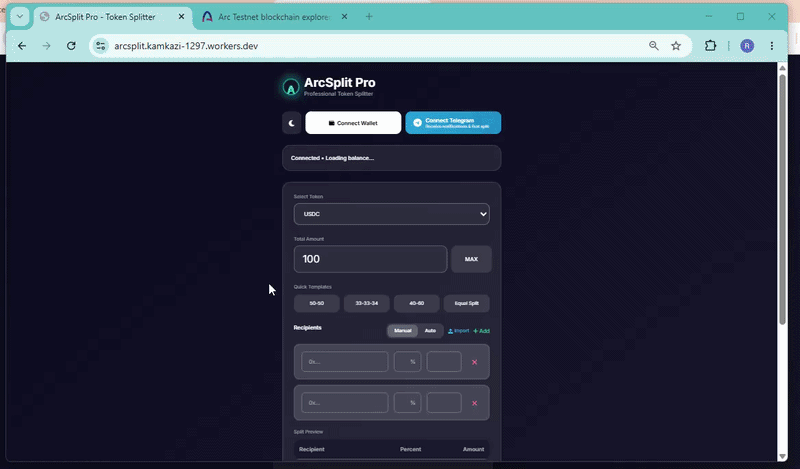

# ArcSplit Pro ⚡

**Professional Token Splitter on Arc Testnet**

A beautiful, fast, and user-friendly tool to split your tokens between multiple addresses with custom percentages.

### Links
- **Live Website**: [arcsplit.kamkazi-1297.workers.dev](https://arcsplit.kamkazi-1297.workers.dev/)
- **Telegram Bot**: `@ArcSplitPro_bot`

---

## ✨ Features

### Web Application
- Modern Glassmorphism UI with Dark/Light mode
- Split tokens by custom percentages
- Quick templates (50-50, 40-60, 33-33-34, etc.)
- Equal Split for any number of recipients
- Distribute Remaining Percentage
- Supports USDC, EURC, and cirBTC
- Real-time split preview
- Transaction history
- Fully responsive design

### Telegram Bot
- Connect your wallet to the bot
- Check balances (USDC, EURC, cirBTC)
- Quick split requests directly from chat
- Receive transaction success notifications
- View recent transaction history

---

## 🚀 How to Use

### From Website:
1. Visit the [live website](https://arcsplit.kamkazi-1297.workers.dev/)
2. Connect your MetaMask wallet (automatically switches to Arc Testnet)
3. Select token and total amount
4. Add recipients with percentages
5. Click **Send Split Transaction**

### From Telegram Bot:
- Start the bot with `/start`
- Connect your wallet
- Use `/balance` to check your balances
- Use `/history` to see recent transactions
- Or simply type: `send 100 USDC 0xaddr1 0xaddr2 ...`

---

## ⚠️ Warning

- This project is for **Arc Testnet only**.
- Do not use real funds.
- For testing and educational purposes.

---

## 🛠️ Tech Stack

- **Frontend**: HTML5, Tailwind CSS, ethers.js v6
- **Backend**: Cloudflare Workers + KV
- **Blockchain**: Arc Testnet
- **Bot**: Telegram Bot API

---

## 📄 License

MIT License

---

**Developed by [kamkazi1297](https://github.com/kamkazi1297)**

⭐ If you like this project, please give it a star!

---

### Demo

**Web App Demo:**

**Telegram Bot Demo:**  
*(Soon - I'll record a short demo of the bot)*
